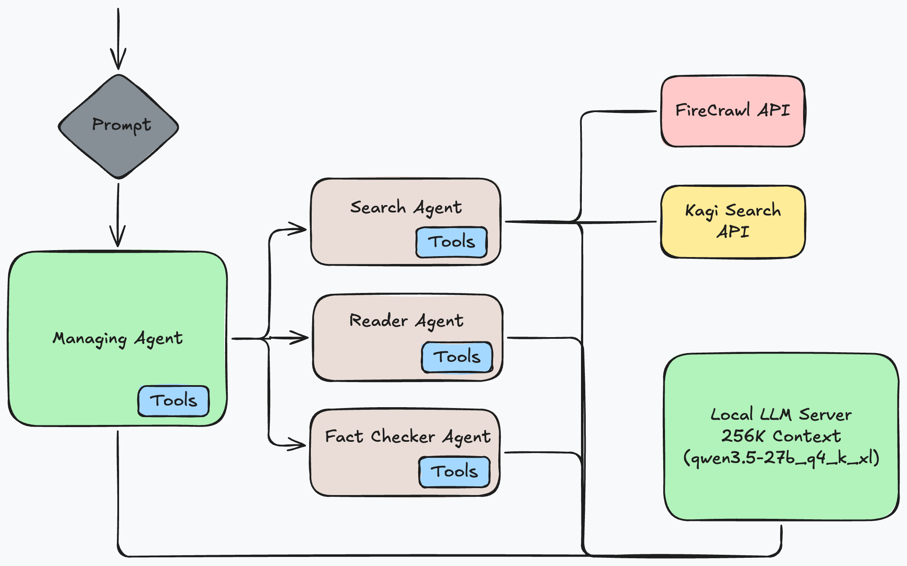

# Deep Research Agent

Just a fun thing I am working on to help me with studying.

Everything is always in development, so be gentle and if something breaks, that's just the nature of it all.

You will need to set the following environment variables:

```
KAGI_API_KEY
```

OPTIONAL:

```
FIRE_CRAWL_API_KEY
```

## PdfToMarkdownTool

- First time running this tool will result in a bunch of small models being downloaded to help with OCR and parsing.
- You'll probably need a GPU to make parsing faster.


# Design

`smolagents` really helped with this implementation. It made it pretty easy to just build this agentic system for research. It is basic, but it is suiting my needs for something that can run over night.

All agents have access to basic tools like file system, and some basic Python libraries.

- 4 total agents (1 manager agent, 3 subagents)
  - Search agent - performs web search (Kagi) and web page crawling (FireCrawl) and returns back data in markdown format for the Reader agent.
  - Reader agent - Does summarization and conversion from PDF to MD if necessary.
  - Fact checker agent - Makes sure that sources are cited in the report, no fake content, etc.
- Local LLM
  - Uses **Qwen3.5-27B** (Q4_K_XL) with **256K context** as the main LLM if hosted on my beefy  AMD Ryzen 9 9800X3D desktop with a 96 GB RTX 6000 Pro.
  - On smaller scale, **Qwen3.5-35B-A3B** (Q4_K_XL) with **256K context** if hosted on a mini-PC with ThunderBolt 3 connection to a 16 GB RTX A4000 GPU. (CPU offloading performed) - I am curious about the AMD Radeon 9700 AI Pro for this type of work (32 GB)



I originally wanted this to be fully local + Kagi search ONLY, but I found that I wasn't getting good quality summaries with just going off of search summaries alone.

I tried basic web page crawling tools and a lot of web sites nowadays just block basic web crawling. The only way around it is to try and beat every CAPTCHA encountered. This is too hard, so I opted to just pay for FireCrawl instead.

The results are much better once I can reliably scrape web pages.

# Example

I have been getting back into retro gaming recently. Now that my daughter can read and has taken an interest in games, I want to spend more time with her in showing her retro-gaming. 

But it's been a while, and I don't know what's out there and what I can do to make a very comfy setup.

I just chose **Qwen3.5-27B** due to its new-ness and a 27B dense model tends to be very strong and at the point where it starts to feel like it's around ChatGPT level (the $20/month plan).

So let's deep research!

```
Perform a deep-dive analysis in how I can use my mini-PC in the year 2026 for seamless retro gaming.

My PC specs:
- Core Ultra 7 258V (Lunar Lake) CPU
- 32 GB LPDDR5X 8533 MT/s
- 1 TB disk

Guidelines:
- I am flexible on the OS necessary to pull this off. I have a TV and can get controllers.
- The games I want to emulate are anything in the PS2 and older generation.
- I want to play with my daughter and introduce her to retro games
- I want to be able to control the mini PC from the TV using just game controllers.
- Game controllers I was thinking of are wireless 8bitdo controllers.
- Low maintenance

Create a comprehensive report of your findings. Cite your sources.

CRITICAL: Output final report as a markdown file.
```
